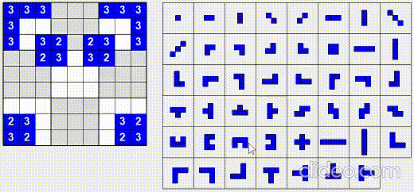

# Blockudoku Solver
An AI solver of the popular mobile game blockudoku implemented in C# & WinForm.
Old school AI involved: Heuristics, Genetic Algorithm.

## How to Use

Run BSolver.UI.exe and click to choose the blocks provided by the game, and when you finished choosing 3, the programme suggests you the next move to take. Repeat until you lose the game.

## Demo Video

